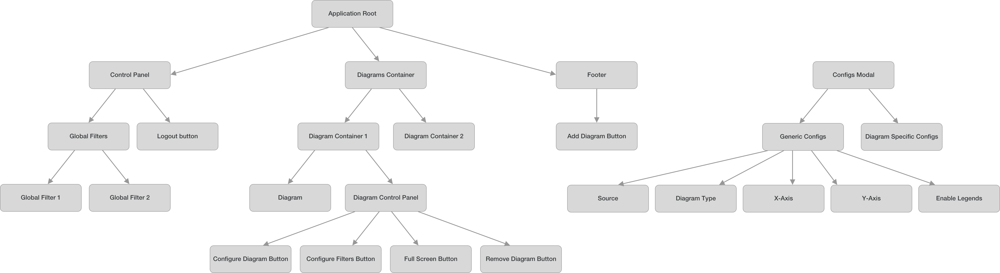

# Design Files of the Frontend

On Windows, the design file can be opened/edited with an awesome free app [Lunacy](https://icons8.com/lunacy).

## Notes

### Diagram Options

#### Generic

```
xAxis: enum JSON attributes
yAxis: enum JSON attributes
useColor: boolean
colorBy: enum JSON attributes
enableLegends: boolean
enableTooltip: boolean
enableAnimation: boolean
diagramType: enum Diagram types
source: enum Source names
```

#### Timeline Plot

```
lineWidth: number px
lineOpacity: 0 <= number <= 1
enablePoints: boolean
enableShapedPoints: boolean
pointSize: number px
pointOpacity: 0 <= number <= 1
enableArea: boolean
areaOpacity: 0 <= number <= 1
```

#### Scatter Plot

```
enableShapedPoints: boolean
pointSize: number px
pointOpacity: 0 <= number <= 1
```

#### Network Diagram

*TBD but...*

```
lineWidth: number px
lineOpacity: 0 <= number <= 1
enableShapedPoints: boolean
pointSize: number px
pointOpacity: 0 <= number <= 1
```

### "Pseudo" UML class diagram



### Activity Sequence

- there's a huge object called `data`, we are not gonna reduce it through to see what range it has (because it might have too many records), instead we keep an `availableRange` and `currentRanges`, then based on these we have a dynamically computed `neededRanges`. `availableRange` has `start` and `end`, while `currentRanges` has array of `start` and `end` tuples. `neededRanges()` return an array of `start` and `end` tuples.

- user moves slider, slider calls back `updateCurrentRangeTo(start, end)`
- inside `updateCurrentRangeTo()` and after `currentRange` gets updated, an action `updateAvailableRange(start, end)` will be fired, fires `neededRanges()` in turn, and calls `pullData(startSubRange, endSubRange)` on every tuple it returns, until it's through - then `availableRange` will be updated and `updateAvailableRange` returns
- `pullData()` handles sending requests to server, then inserts them in to `data`.

- the diagrams components are decorated as MobX observers, and observes `data` and `currentRange` - that is when `currentRange` updated, it should update the Y axis of the diagram (if Y is time), then when data is pulled block by block, it paints the graphs correspondingly
